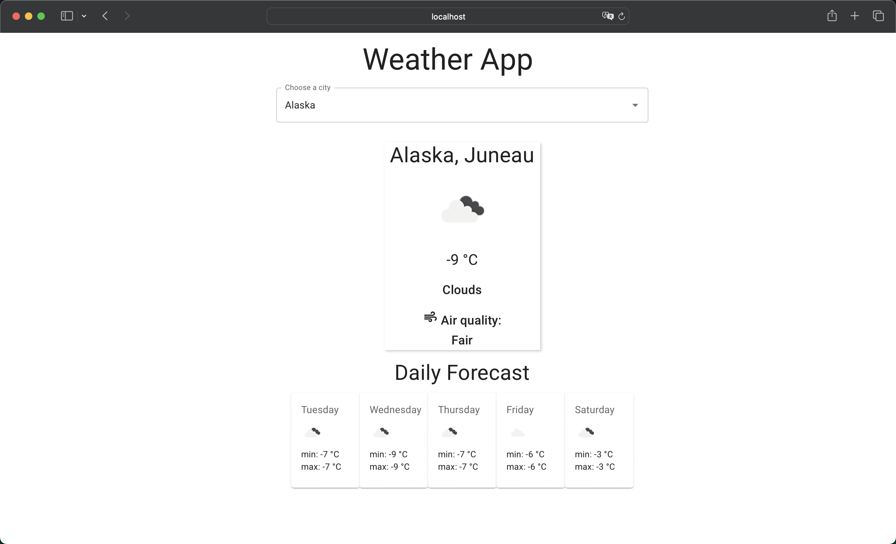

# Weather App

React web application that displays real-time weather, forecast, and air pollution data for state capitals in the USA.


## Screenshots




## Resources used

Rest countries API: https://www.geonames.org/

Open Weather API: https://openweathermap.org/api
## Run Locally

Clone the project

```bash
  git clone https://github.com/Christianconh/weatherApp.git
```

Go to the project directory

```bash
  cd weatherApp
```

Install dependencies

```bash
  npm install
```

Start the server

```bash
  npm run dev
```

